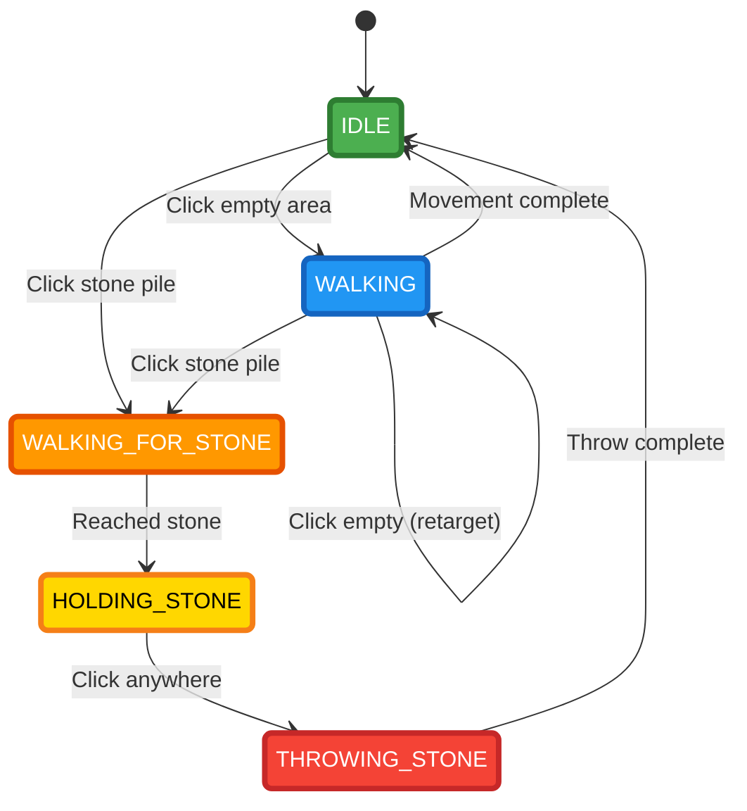

---
# OrcAttack

---
# OrcAttack

Player State Machine

## State Details

| State | Value | stone_id | Animation | Description |
|-------|-------|----------|-----------|-------------|
| 🟢 **IDLE** | 1 | `nil` | None | Player standing still, waiting for input |
| 🔵 **WALKING** | 2 | `nil` | `position.x` EASING_LINEAR, 300px/s | Walking to clicked position, can retarget |
| 🟠 **WALKING_FOR_STONE** | 3 | `nil` | `position.x` EASING_LINEAR, 300px/s | Walking to stone pile, will grab on arrival |
| 🟡 **HOLDING_STONE** | 4 | Valid ID | None | Holding stone (parented, local pos 0,50,0, scale 2x) |
| 🔴 **THROWING_STONE** | 5 | Valid ID | `position.x` EASING_LINEAR, 300px/s | Walking to throw position, stone follows |

## Key Functions

### `grab_stone(self)`
- Creates stone via `factory.create("#stone_factory")`
- Sets stone as child of player: `go.set_parent(stone_id, player_id)`
- Local position: `(0, 50, 0)`
- Scale: `2.0`

### `throw_stone(self, target_x)`
- Animates player to target position
- On completion:
  - Unparents stone: `go.set_parent(stone_id, nil)`
  - Sets world position: `(player.x, 110, 0)`
  - Clears `stone_id = nil`

### `is_stone_collider_clicked(click_pos, stone_pos, stone_size)`
- Bounding box collision detection
- Stone size: `100 x 300` pixels
- Checks `stones_left` and `stones_right`
